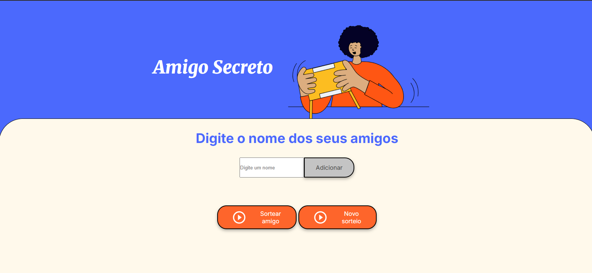

<h1 align="center"> Challenge do amigo secreto! </h1>

  
  
  

O projeto se trata de uma página de sorteio aleatórios de nomes, no qual você incluir os nomes uqe deseja e realiza o sorteio, mostrando no final o nome sorteado. 

# Demonstração das funcionalidades:

> Você poderá estar acessando o projeto na web atraves do link:

> https://challenge-amigo-secreto-tau-nine.vercel.app/

 

## 💻 Autora

| [ Nayara Nascimento ](https://github.com/Nay0202) 
| :---: | 

 
